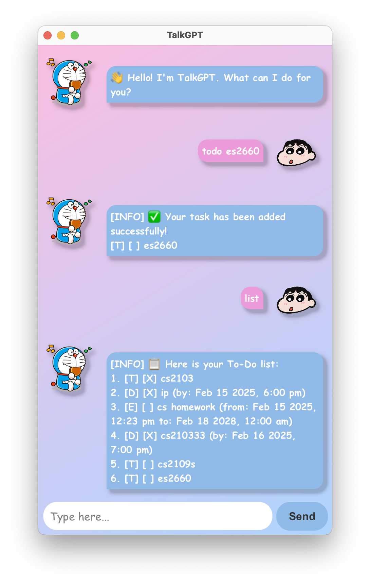

# 📝 TalkGPT User Guide

## 📌 Introduction

Welcome to **TalkGPT**, your interactive chatbot! 🤖💬 This guide will help you understand how to use TalkGPT, the available commands, and troubleshooting tips.

## 🤩 TalkGPT UI Preview
<div align="center">
   
</div>

## 🚀 Getting Started

### **1️⃣ Launching the Chatbot**

To start TalkGPT:

1. Open the application. (If using the jar file, start with `java -jar talkgpt.jar`)
2. The chatbot will greet you with:
   ```
   👋 Hello! I'm TalkGPT. What can I do for you?
   ```
3. Start chatting by typing a message in the input field and pressing **Enter** or the **Send** button. 🚀

## 🗂️ Available Commands

TalkGPT understands several commands to help manage your tasks and interact efficiently. Here’s a list of available commands:

### **📝 Task Management**

| **Command**                                                                    | **Description**                             | **Example**                                                       |
|--------------------------------------------------------------------------------|---------------------------------------------|-------------------------------------------------------------------|
| `list`                                                                         | Displays all your tasks.                    | `list`                                                            |
| `todo <description>`                                                           | Adds a new **To-Do task**.                  | `todo Buy groceries`                                              |
| `deadline <description> /by <dd/mm/yyyy hhmm>`                                 | Adds a **Deadline task**.                   | `deadline Submit report /by 20/02/2025 2359`                      |
| `event <description> /from <start: dd/mm/yyyy hhmm> /to <end: dd/mm/yyyy hhmm>` | Adds an **Event task**.                     | `event Project meeting /from 19/02/2025 1400 /to 19/02/2025 1600` |
| `mark <task_id>`                                                               | Marks a task as completed. ✅                | `mark 1`                                                          |
| `unmark <task_id>`                                                             | Unmarks a completed task. ❌                 | `unmark 1`                                                        |
| `delete <task_id>`                                                             | Deletes a task. 🗑️                         | `delete 2`                                                        |
| `clear`                                                                        | Removes **all** tasks. 🚀                   | `clear`                                                           |
| `list_on <dd/mm/yyyy>`                                                         | Lists tasks due on a specific date. 📅      | `list_on 21/02/2025`                                              |
| `find <keyword>`                                                               | Searches for tasks containing a keyword. 🔍 | `find report`                                                     |


### **General Command**
| **Command** | **Description**                  |
| ----------- | -------------------------------- |
| `help`      | Shows all available commands. ℹ️ |
| `bye`       | Exits the chatbot. 👋            |

## 📸 Chatbot Features

### **🎨 Beautiful UI**

- 🌈 **Gradient Background** for a modern look.
- 🐶 **Animated Characters** for a friendly feel.
- ✨ **Smooth Rounded Messages** for better readability.
- 📸 **Emoji Support** for expressive responses!

### **🎭 Randomized Responses**

If you enter an **unknown command**, TalkGPT will respond dynamically:

```
[ERROR] 😅 Oops! That doesn't seem like a valid command.
```

The chatbot will **randomly cycle through different responses** to make the conversation more engaging! 🎲

## 🔧 Troubleshooting

### **🛑 Why is my input not working?**

If the chatbot does not respond:

- Make sure you entered a valid command.
- Restart the application.
- Check for **error messages**.

## 🎯 Conclusion

TalkGPT is designed to **make task management fun and interactive!** 🎉 If you have suggestions or feedback, feel free to improve the chatbot experience!

👋 **Enjoy chatting with TalkGPT!** 🚀
